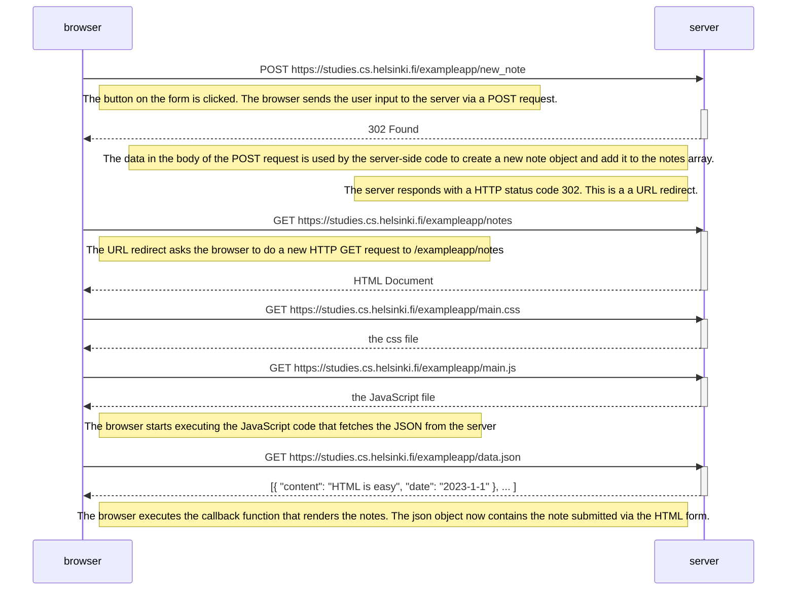

```mermaid
sequenceDiagram
    participant browser
    participant server

    browser->>server: POST https://studies.cs.helsinki.fi/exampleapp/new_note
        Note right of browser: The button on the form is clicked. The browser sends the user input to the server via a POST request.
    activate server
    server-->>browser: 302 Found
    deactivate server

    Note left of server: The data in the body of the POST request is used by the server-side code to create a new note object and add it to the notes array.

    Note left of server: The server responds with a HTTP status code 302. This is a a URL redirect.


      browser->>server: GET https://studies.cs.helsinki.fi/exampleapp/notes
    activate server
        Note right of browser: The URL redirect asks the browser to do a new HTTP GET request to /exampleapp/notes
    server-->>browser: HTML Document
    deactivate server

    browser->>server: GET https://studies.cs.helsinki.fi/exampleapp/main.css
    activate server
    server-->>browser: the css file
    deactivate server

    browser->>server: GET https://studies.cs.helsinki.fi/exampleapp/main.js
    activate server
    server-->>browser: the JavaScript file
    deactivate server

    Note right of browser: The browser starts executing the JavaScript code that fetches the JSON from the server

    browser->>server: GET https://studies.cs.helsinki.fi/exampleapp/data.json
    activate server
    server-->>browser: [{ "content": "HTML is easy", "date": "2023-1-1" }, ... ]
    deactivate server

    Note right of browser: The browser executes the callback function that renders the notes. The json object now contains the note submitted via the HTML form.
```