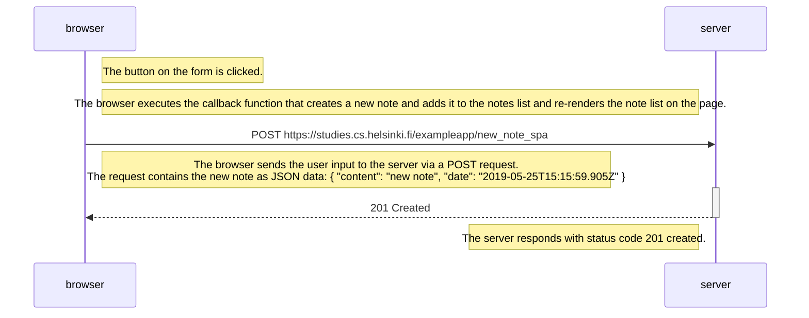

```mermaid
sequenceDiagram
    participant browser
    participant server


   Note right of browser: The button on the form is clicked. 
    Note right of browser: The browser executes the callback function that creates a new note and adds it to the notes list and re-renders the note list on the page.

    browser->>server: POST https://studies.cs.helsinki.fi/exampleapp/new_note_spa 
   
    Note right of browser: The browser sends the user input to the server via a POST request.<br>   The request contains the new note as JSON data: { "content": "new note", "date": "2019-05-25T15:15:59.905Z" }
    activate server
    server-->>browser: 201 Created
    deactivate server

    Note left of server: The server responds with status code 201 created. 

```